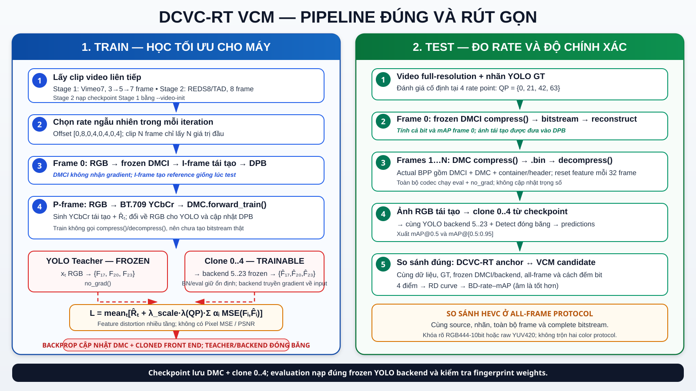

# DCVC-RT VCM — video-only training with multi-level task features



Repository này fine-tune **phần video DMC của DCVC-RT** cho bài toán Video
Coding for Machines (VCM). DMCI chỉ mã hóa/tái tạo I-frame tham chiếu và bị đóng
băng hoàn toàn; YOLO teacher và task backend cũng đóng băng. Thành phần được cập
nhật là:

- DCVC-RT DMC;
- cloned YOLOv5 **năm layer đầu `0..4`** (mặc định; có thể đóng băng để làm
  ablation). YOLO task back end `5..23` và `Detect` giữ nguyên pretrained và
  đóng băng.

Loss chính:

\[
L = \hat R_P + \lambda_{feat}(q)D_{feat},
\qquad
D_{feat}=\frac{D_{17}+D_{20}+D_{23}}{3}.
\]

`D_feat` kế thừa **ý tưởng multi-level feature distortion** của TransTIC. Bản
TransTIC chính thức dùng ResNet50-FPN `P2..P6`; cấu hình main của dự án này dùng
YOLOv5 PAN/FPN layer `17,20,23` (stride `8,16,32`) — đúng ba tensor được đưa
trực tiếp vào `Detect`. Layer `4,6,9` chỉ còn là ablation backbone. Vì vậy tên
mô tả đúng là **TransTIC-inspired multi-level YOLO task-pyramid loss**, không
phải tái lập nguyên implementation TransTIC.

## Những quyết định protocol đã khóa

| Thành phần | Thiết lập |
|---|---|
| Phạm vi train | DMC + cloned YOLO layer `0..4` |
| Đóng băng | DMCI, YOLO teacher, YOLO task backend `5..23` + Detect |
| Miền màu codec | full-range BT.709 YCbCr 4:4:4 |
| Miền màu task | RGB `[0,1]` |
| QP train | random integer đều trong `[0,63]`, độc lập trên mỗi rank/batch |
| QP P-frame | offset DCVC-RT `0,8,0,4,0,4,0,4` |
| λ | log interpolation `1→768`, nhân `lambda_scale` |
| QP validation/evaluation | `0,21,42,63` |
| Dataset mặc định | Vimeo-90K septuplet, 7 frame/clip |
| Curriculum 15 epoch | `3→5→7` frame tại epoch `1,3,6` |
| Optimizer | AdamW; DMC `1e-5`, clone `1e-6` |
| Distributed | DDP + DistributedSampler + `no_sync`; TBPTT tự bật unused-parameter detection |
| Training kernels | autograd-safe PyTorch path; fused CUDA inference bị khóa |
| Metric cuối | actual BPP, mAP@0.5, mAP@[0.5:0.95], BD-rate-mAP |

Luồng màu thống nhất:

```text
RGB source ──┬──> frozen YOLO teacher ──> target layer 17/20/23
             │
             └──> RGB→YCbCr BT.709 ──> DMCI/DMC ──> YCbCr→RGB
                                                   └──> cloned layer 0..4
                                                        └──> frozen layer 5..23
                                                             └──> loss 17/20/23
```

Không chuyển sẵn toàn bộ Vimeo thành file YUV. Conversion được thực hiện bằng
tensor trong pipeline và giống phép biến đổi của evaluator DCVC-RT chính thức.

## Căn cứ implementation

- Kiến trúc/checkpoint/test pipeline:
  [Microsoft DCVC-RT](https://github.com/microsoft/DCVC/tree/main/DCVC-family/DCVC-RT).
- DDP, pretrained image reference và curriculum sequence:
  [official DCVC training pipeline](https://github.com/microsoft/DCVC/blob/main/train_video.py).
- Multi-level feature distortion:
  [TransTIC paper](https://arxiv.org/abs/2306.05085) và
  [official detection implementation](https://github.com/NYCU-MAPL/TransTIC/blob/master/examples/detection.py).

Training source của riêng DCVC-RT CVPR 2025 không được Microsoft công bố. Do đó
repo này không tuyên bố “tái lập chính xác training code DCVC-RT”; nó giữ đúng
DCVC-RT architecture/checkpoint/QP-shift/color pipeline và kế thừa nguyên tắc
sequence training từ pipeline DCVC chính thức, sau đó thay pixel objective bằng
rate–feature objective phục vụ VCM.

## Cài đặt

Python 3.10+ và CUDA/PyTorch tương thích GPU:

```bash
pip install -r requirements.txt
```

Build entropy coder chỉ cần cho actual-bitstream evaluation:

```bash
cd src/cpp
pip install .
cd ../..
```

Chuẩn bị ba input không được đưa vào Git:

```text
cvpr2025_image.pth.tar
cvpr2025_video.pth.tar
yolov5s.pt + checkout YOLOv5 tag v7.0 (khi chạy offline)
```

## Kiểm tra Vimeo trước khi train

```bash
python validate_dataset.py \
  --root /data/vimeo_septuplet/sequences \
  --list-file /data/vimeo_septuplet/sep_trainlist.txt \
  --frames 7 \
  --crop-size 256 \
  --training
```

Output phải có `status=PASS`, `frames_per_sample=7`, `channels=3` và đúng số
sequence trong list mà bạn dùng. Không ghi “full Vimeo-90K” nếu list chỉ chứa
subset 7.014 sequence.

## Smoke test hai GPU

```bash
torchrun --standalone --nproc_per_node=2 train_vcm_final.py \
  --training-stage vimeo7 \
  --data-dir /data/vimeo_septuplet/sequences \
  --train-list /data/vimeo_septuplet/sep_trainlist.txt \
  --val-dir /data/vimeo_septuplet/sequences \
  --val-list /data/vimeo_septuplet/sep_testlist.txt \
  --image-checkpoint /weights/cvpr2025_image.pth.tar \
  --video-init /weights/cvpr2025_video.pth.tar \
  --yolov5-repo /opt/yolov5 \
  --yolov5-weights /weights/yolov5s.pt \
  --checkpoint-dir checkpoints/smoke \
  --crop-size 128 \
  --epochs 1 \
  --max-batches 4 \
  --max-validation-batches 2 \
  --validate-every 1 \
  --save-every 0
```

Smoke test đạt khi:

- `world_size=2`;
- loss/BPP/feature/PSNR hữu hạn;
- `skipped=0`;
- có `latest.pt`, `run_config.json`, CSV epoch và JSONL batch log;
- DMC/clone có gradient, DMCI không nằm trong optimizer.

## Stress test cấu hình nặng nhất trước full run

Smoke test 128/3-frame chưa chứng minh cấu hình final vừa VRAM. Chạy thêm đúng
7 frame, crop 256 trên hai T4:

```bash
torchrun --standalone --nproc_per_node=2 train_vcm_final.py \
  --training-stage vimeo7 \
  --data-dir /data/vimeo_septuplet/sequences \
  --train-list /data/vimeo_septuplet/sep_trainlist.txt \
  --image-checkpoint /weights/cvpr2025_image.pth.tar \
  --video-init /weights/cvpr2025_video.pth.tar \
  --yolov5-repo /opt/yolov5 \
  --yolov5-weights /weights/yolov5s.pt \
  --checkpoint-dir checkpoints/stress_7f_256 \
  --crop-size 256 --epochs 1 \
  --vimeo-curriculum-frames 7 \
  --vimeo-curriculum-start-epochs 1 \
  --accumulation-steps 1 --tbptt-steps 0 \
  --max-batches 2 --validate-every 99 --save-every 0
```

Sau full-BPTT stress test, chạy riêng nhánh fallback DDP–TBPTT để kiểm tra đúng
trường hợp parameter usage thay đổi giữa các chunk:

```bash
torchrun --standalone --nproc_per_node=2 train_vcm_final.py \
  --training-stage vimeo7 \
  --data-dir /data/vimeo_septuplet/sequences \
  --train-list /data/vimeo_septuplet/sep_trainlist.txt \
  --image-checkpoint /weights/cvpr2025_image.pth.tar \
  --video-init /weights/cvpr2025_video.pth.tar \
  --yolov5-repo /opt/yolov5 \
  --yolov5-weights /weights/yolov5s.pt \
  --checkpoint-dir checkpoints/stress_tbptt_7f \
  --crop-size 128 --epochs 1 \
  --vimeo-curriculum-frames 7 \
  --vimeo-curriculum-start-epochs 1 \
  --accumulation-steps 1 --tbptt-steps 2 \
  --max-batches 3 --validate-every 99 --save-every 0
```

Khi `tbptt_steps>0`, code tự đặt DDP `find_unused_parameters=True`; khi
`tbptt_steps=0` giá trị là `False`. Nếu full-BPTT 7-frame/crop-256 OOM, dùng
`--tbptt-steps 2` cho final run và ghi rõ truncated BPTT trong báo cáo.

## Lệnh train 15 epoch

```bash
torchrun --standalone --nproc_per_node=2 train_vcm_final.py \
  --training-stage vimeo7 \
  --data-dir /data/vimeo_septuplet/sequences \
  --train-list /data/vimeo_septuplet/sep_trainlist.txt \
  --val-dir /data/vimeo_septuplet/sequences \
  --val-list /data/vimeo_septuplet/sep_testlist.txt \
  --image-checkpoint /weights/cvpr2025_image.pth.tar \
  --video-init /weights/cvpr2025_video.pth.tar \
  --yolov5-repo /opt/yolov5 \
  --yolov5-weights /weights/yolov5s.pt \
  --checkpoint-dir checkpoints/vcm_vimeo7 \
  --epochs 15 \
  --crop-size 256 \
  --batch-size-per-gpu 1 \
  --accumulation-steps 4 \
  --tbptt-steps 0 \
  --learning-rate 1e-5 \
  --frontend-learning-rate 1e-6 \
  --lambda-scale 0.006 \
  --vimeo-curriculum-frames 3 5 7 \
  --vimeo-curriculum-start-epochs 1 3 6 \
  --validation-qps 0 21 42 63 \
  --validate-every 1 \
  --max-validation-batches 25 \
  --save-every 5
```

Effective batch mặc định: `2 GPU × 1 clip/GPU × accumulation 4 = 8 clips`.
Rate path giữ FP32. `tbptt=0` là full temporal graph. Nếu T4 bị OOM, giữ đủ bảy
frame nhưng dùng `--tbptt-steps 2`; đây là truncated BPTT và phải ghi rõ trong
báo cáo, không được mô tả là full BPTT.

### Ablation backbone `4/6/9`

Main run không cần truyền `--feature-layer-indices` vì mặc định là
`17 20 23`. Chỉ chạy ablation backbone bằng:

```text
--feature-layer-indices 4 6 9
```

Ablation vẫn chỉ train cloned layer `0..4`; layer `5..9` đóng băng. Không dùng
checkpoint main `17/20/23` để resume ablation hoặc ngược lại.

### Hiệu chỉnh λ trước final run

`1→768` là hình dạng QP–λ kế thừa từ DCVC; nó không phải dải đã được paper kiểm
chứng cho YOLO Feature MSE. `lambda_scale=0.006` chỉ là điểm khởi tạo; gradient
diagnostic cũ ở layer `4/6/9` không được tái sử dụng để kết luận cho
`17/20/23`. Trước final run, chạy lại pilot sweep tối thiểu vài trăm batch cho
mỗi scale; không dùng smoke 4 batch để chọn λ:

```text
lambda_scale ∈ {0.003, 0.006, 0.010}
```

Chọn scale mà:

- BPP không collapse;
- BPP tăng theo `QP 0→21→42→63`;
- feature loss và rate đều có gradient hữu hạn;
- bốn actual BPP–mAP points tạo Pareto front.

## Log và checkpoint

```text
checkpoints/vcm_vimeo7/
├── latest.pt
├── best_proxy.pt
├── epoch_5.pt
├── epoch_10.pt
├── epoch_15.pt
├── run_config.json
└── logs/
    ├── latest_training_history.csv
    ├── latest_training_curves.png
    ├── video_vcm_...csv
    ├── video_vcm_..._batches.jsonl
    └── video_vcm_..._training_curves.png
```

CSV ghi loss, estimated BPP, feature từng tầng, RGB PSNR/MSE, Y/chroma MSE,
I-frame PSNR, QP/λ, LR, grad norm, GPU memory, thời gian và validation riêng từng
QP. Checkpoint lưu RNG state từng rank, optimizer/scheduler, color protocol và
hash các source checkpoint.

CSV được flush sau mọi epoch và toàn bộ lịch sử epoch được nhúng vào checkpoint.
Khi resume, run mới khôi phục lịch sử này trước khi ghi tiếp. Biểu đồ tổng hợp
`total loss`, `estimated BPP` và `Feature MSE` chỉ được tạo khi stage kết thúc hoặc
chương trình đi qua cleanup sau `Ctrl+C`/exception; biểu đồ không được vẽ lại sau
từng epoch.

`best_proxy.pt` dùng geometric mean của bốn validation objectives để tránh QP có
λ lớn chi phối. Nó chỉ là checkpoint proxy. Checkpoint final phải được chọn từ
`epoch_5/10/15` bằng **actual BPP–mAP trên validation có nhãn**, không chọn trên
test set và không gọi `best_proxy.pt` là tốt nhất theo BD-rate.

## Actual BPP–mAP evaluation

Evaluator mã hóa toàn bộ sequence:

```text
frame 0: frozen DMCI (bit + mAP đều được tính)
frame 1..N-1: DMC (bit + mAP đều được tính)
```

```bash
python evaluate_vcm.py --mode codec \
  --data-dir /data/vcm_eval \
  --dataset-manifest manifest.json \
  --image-ckpt /weights/cvpr2025_image.pth.tar \
  --video-ckpt checkpoints/vcm_vimeo7/epoch_15.pt \
  --yolov5-repo /opt/yolov5 \
  --yolov5-weights /weights/yolov5s.pt \
  --method-name dcvc_rt_vcm \
  --qps 0 21 42 63 \
  --reset-interval 32 \
  --codec-precision fp16 \
  --minimum-sequence-frames 100
```

Chạy cùng lệnh với `cvpr2025_video.pth.tar` để tạo DCVC-RT anchor. Hai kết quả
đều dùng DMCI, cùng frame, cùng frozen task backend/threshold/labels và cùng
all-frame protocol. Evaluator dùng đúng inference DCVC-RT: hai entropy coder khi
`W×H > 1280×720`, feature reset mỗi 32 frame và codec FP16. JSON ghi
`estimated_bpp`, `actual_bpp`, tỷ lệ `actual/estimated` và SHA-256 của cloned
front end.

`--minimum-sequence-frames 100` là preflight bắt buộc cho lượt đánh giá
long-sequence; evaluator sẽ dừng nếu có sequence ngắn hơn. Mỗi rate point ghi
thêm actual/estimated BPP và mAP theo năm vùng temporal:

```text
frame 0 | frame 1–7 | frame 8–31 | frame 32–63 | frame 64+
```

So sánh các vùng này với DCVC-RT anchor để phát hiện bitrate tăng hoặc mAP drift
sau horizon train bảy frame và quanh reset interval 32. **Không cần train thêm
long sequence trước main run.** Chỉ fine-tune long sequence sau epoch 15 nếu
diagnostic cho thấy candidate drift rõ hơn anchor; khi đó dùng 1–3 epoch, LR
thấp và TBPTT, không trộn kết quả đó với main run nếu chưa báo cáo ablation.

Candidate dùng cloned front end đã train; HEVC/DCVC-RT anchor dùng pretrained
front end gốc. Vì vậy BD-rate ở đây là so sánh **hệ thống VCM end-to-end**, không
được mô tả là mọi codec dùng cùng toàn bộ detector. `detector_config` khóa chung
weights/backend/threshold gốc, còn `machine_frontend` khai báo riêng cho từng hệ
thống và được đưa vào file kết quả. Evaluator nạp clone `0..4` từ checkpoint,
nạp backend `5..23 + Detect` từ `--yolov5-weights`, kiểm tra SHA-256 phải khớp
với lúc train rồi đặt toàn bộ detector ở `eval` với `requires_grad=False`.

Tính BD-rate giữa DCVC-RT anchor và candidate:

```bash
python evaluate_vcm.py --mode bdrate \
  --anchor-results output/evaluation/dcvc_rt_anchor_results.json \
  --candidate-results output/evaluation/dcvc_rt_vcm_results.json \
  --rate actual_bpp \
  --metric map5095
```

So sánh thêm HEVC/Learned Scalable bằng `compare_codecs_bd_rate.py`. BD-rate chỉ
được tính nếu bốn points Pareto-optimal, mAP tăng theo bitrate và hai curve có
vùng mAP giao nhau. Giá trị BD-rate âm nghĩa là candidate tiết kiệm bitrate tại
cùng mAP.

## HEVC anchor và kênh màu

Với source PNG/RGB, mặc định `evaluate_hevc.py` dùng BT.709 YUV444 10-bit và
all-frame bitstream, theo test condition Microsoft đề xuất cho RGB content:

```bash
python evaluate_hevc.py \
  --data-dir /data/vcm_eval \
  --dataset-manifest manifest.json \
  --x265-encoder x265 \
  --preset medium \
  --chroma-format 444 \
  --bit-depth 10 \
  --qps 22 27 32 37
```

Nếu nguồn chuẩn thực sự là YUV420, anchor truyền thống phải mã hóa YUV420 gốc;
không nên coi PNG đã qua conversion là source gốc. Chế độ `--chroma-format 420`
chỉ phục vụ protocol đó và phải được mô tả tách biệt.

## Kiểm tra source

```bash
python -m compileall -q .
python -m unittest discover -s tests -v
git diff --check
```

Unit test kiểm tra round-trip BT.709, QP offsets, λ endpoints, curriculum 15
epoch, DDP policy của TBPTT, topology main `17/20/23`, graph routing YOLO,
temporal bins, miền scale rate, ngưỡng 2 entropy coder, multi-level feature MSE,
all-frame/reset container và kích thước YUV420/444.

## File chính

```text
train_vcm_final.py              DDP sequence training
src/models/image_model.py       frozen DCVC-RT DMCI
src/models/video_model.py       DCVC-RT DMC + differentiable rate path
src/models/vcm_system.py        color/DMCI/DMC/task orchestration
src/models/vcm_loss.py          TransTIC-inspired multi-level feature loss
src/utils/transforms.py         full-range BT.709 RGB↔YCbCr
evaluate_vcm.py                 all-frame actual BPP/mAP/BD-rate
evaluate_hevc.py                x265 HEVC Low-Delay P RGB444-10bit or YUV420 anchor
compare_codecs_bd_rate.py       three-codec BD-rate comparison
validate_dataset.py             preflight dataset validation
```
